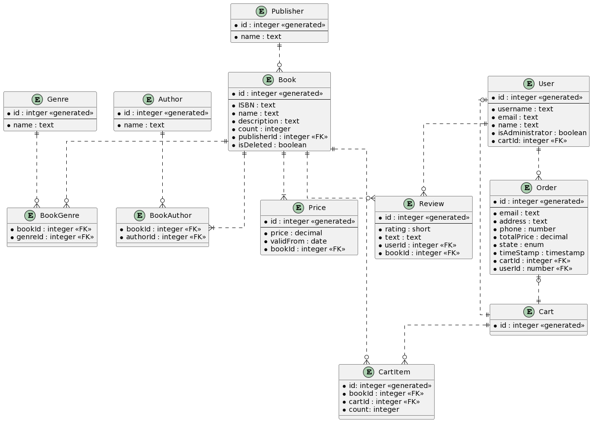
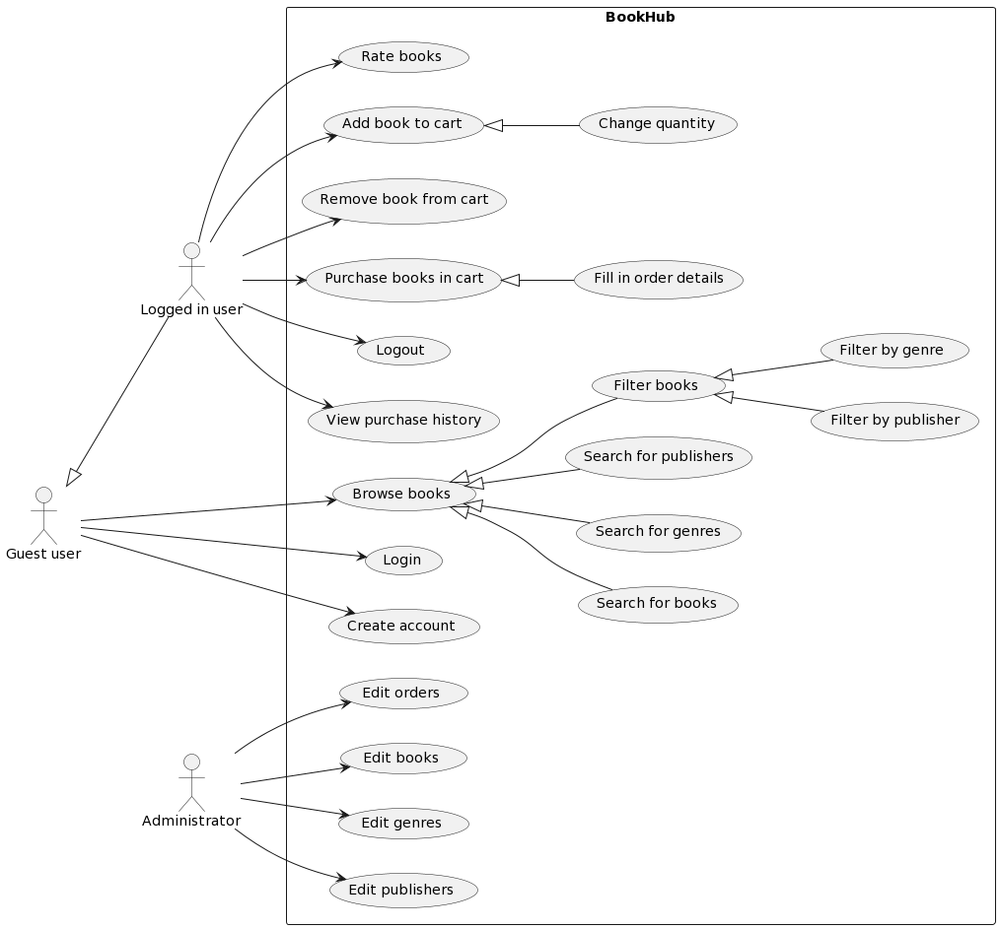

# PV179 Project – BookHub

Develop a digital platform for the company called "BookHub", a company that sells books of various genres. The platform should facilitate easy browsing and purchase of books, letting customers sort and filter by authors, publishers, and genres. After customers create accounts, they should be able to review their purchase history, rate books, and make wishlists. Administrators should have privileges to update book details, manage user accounts, and regulate book prices.

## Authors

- Bc. Petr Čermák ([483005](https://is.muni.cz/auth/osoba/483005))
- Bc. Ladislav Dlhopolček ([485603](https://is.muni.cz/auth/osoba/485603))
- Bc. Adam Zálešák ([493071](https://is.muni.cz/auth/osoba/493071))

## Project planning

### Entity Relationship Diagram 



### Use Case Diagram




## How to run

1. Clone the repository from:

```
https://gitlab.fi.muni.cz/xzalesak/pv179-bookhub.git
```

2. Prepare database for the system. For Visual Studio use Package Manager Console, with DataAccessLayer as default project:

- Add Migration

``` 
Add-Migration MyMigration 
```

- Update database

``` 
Update-Database
```

3. Set WebApi as startup project
4. Build the solution
5. Run the solution

## Main Components

### Book

Manages stored **Books** and their filtering, together with **Authors** and **Publishers** and **Genres** represents store stock and its description.

### Order

With the cooperation of **Cart** and **Price** handles ordeding and pricing requests.  

### User

Manages basic **User** proccess handling with future implementation of Authentication. With extension of **Review** handles all non ordering user actiivities.

### Logging Middleware

Handles logging of all requests for the system. Currently only storing all  
requests in formated way.

### Authentication Middleware

Custom authentication middleware with token base authentication system. For now, using only one static **Token** 